<!DOCTYPE html>
<html>
<head>
  <meta charset="utf-8">
  <meta name="generator" content="pandoc">
  <meta name="author" content="Jieun K">
  <meta name="dcterms.date" content="2021-07-17">
  <!--<title>Data Analytics in Practice</title> -->
  <meta name="apple-mobile-web-app-capable" content="yes">
  <meta name="apple-mobile-web-app-status-bar-style" content="black-translucent">
  <meta name="viewport" content="width=device-width, initial-scale=1.0, maximum-scale=1.0, user-scalable=no, minimal-ui">
  <link rel="stylesheet" href="./revealjs/dist/reset.css">
  <link rel="stylesheet" href="./revealjs/dist/reveal.css">
  <link rel="stylesheet" href="./revealjs/dist/theme/black.css" id="theme">
</head>
<body>
  

    
      
      <section id="title-slide">
        <h1 class="title">Data Analytics in Practice</h1>
        <h3>
Couse Project
</h3>        
        
Jieun K

        
August 4, 2021

      </section>
      <!-- SLIDE: Subtitle -->
      <section id="eda-feature-engineering-and-regression-modelling-with-real-estate-data" class="title-slide slide level1">
        <h2>EDA, Feature Engineering , and Regression Modelling with Real Estate Data </h2>
      </section>
      <!-- ============================================================== -->
      <!-- SLIDE: abstract -->      
      <section class="slide level1">
        <section id="abstract-what-is-the-project-about" class="title-slide slide level2">
          <h3>What is the project about ❓</h3>
        </section>  
        <section class="slide level2">    
        
Practice data science with real-estate data

        </section>
        <section class="slide level2">      
        
Demonstrate a commonly used pipeline ➡️

        </section>
        <section class="slide level2">      
        
Preprocessing ⇒ 
         EDA  ⇒ Feature Engineering ⇔ Modelling ⇒ Performance Evaluation

        </section>        
        <!-- 
        <section id="pose-a-question" class="slide level2">
          <h4>Fit a Model</h4>
          <ul>
          <li>Build a regression model</li>
          <li>Do feature engineering  if possible</li>
          </ul>
        </section>
        <section id="and-answer" class="slide level2">
          <h4>Predict and Evaluate</h4>
          <li>Predict monthly rent based on historical data</li>
          <li>Gauage performance with evaluation metrics</span</li>
        </section> -->
      </section>
      <!-- ============================================================== -->
      <!-- SLIDE: sections -->
      <section class="slide level1">
        <section id="sections" class="title-slide slide level2">          
          <h2>Sections</h2>
        </section>
        <section class="slide level2">    
          <ul>
          <li>Introduction</li>
          <li>Dataset</li>
          <li>Pre-processing</li>
          <li>EDA</li>
          <li>Feature Engineering</li>
          <li>Model Fitting</li>
          <li>Prediction and Evaluation</li>
          <!-- <li>Conclusion</li> -->
          </ul>
        </section>
      </section>
      <!-- ============================================================== -->
      <!-- SLIDE: introduction -->
      <section class="slide level1">
        <section id="introduction" class="title-slide slide level2">          
          <h2>Introduction</h2>
        </section>
        <section id="introduction-1" class="slide level2">
          <h3>Introduction</h3>
          <ol type="1">
          <li>
What is an officetel❓
</li>
          <li>
A growing portion of the housing market
</li>
          <li>
Did Covid-19 change anything❓
</li>
          <li>
Objectives of the project
</li>
          </ol>
        </section>
      </section>
      <!-- SLIDE: intro-definition -->           
      <section class="slide level1">
        <section id="what-is-an-officetel" class="title-slide slide level2">
          <h3>1. What is an officetel?</h3>
        </section>
        <section class="slide level2">
          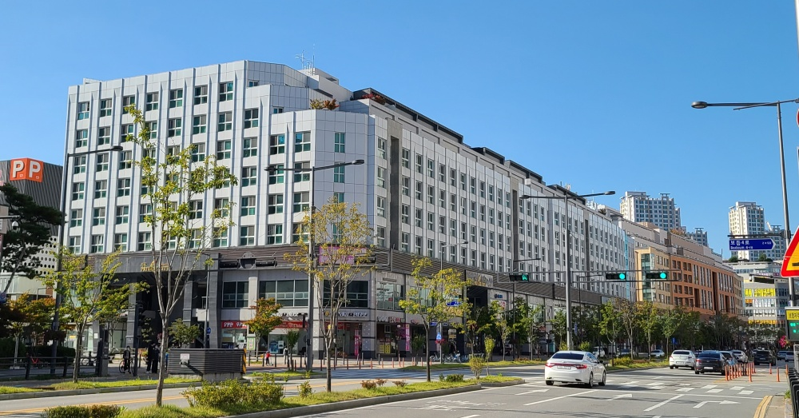
          
A building with both residential and commercial units
          
        </section>
        <section class="slide level2">
          A combination of <em>office</em> and <em>hotel</em>
        </section>        
        <section class="slide level2">
          Offers convenience through amenities inside or around the property
        </section>        
        <section class="slide level2">
          Amenities:   |
          dry-cleaning &amp; laundry services 🧼 | 
           | gyms 💪 
           | restaurants 🥘 | 
            | hair salons ✂️ | shops 🛍️ |  
        </section>
      </section>
      <!-- ============================================================== -->
      <!-- SLIDE: introduction -->
      <section class="slide level1">
        <section id="introduction-1" class="slide level2">
          <h3>Introduction</h3>
          <ol type="1">
          <li>
What is an officetel❓
</li>
          <li>
 A growing portion of the housing market
</li>
          <li>
Did Covid-19 change anything❓
</li>
          <li>
Objectives of the project
</li>
          </ol>
        </section>
      </section>
      <!-- SLIDE: intro-growing share -->           
      <section class="slide level1">        
        <section id="officetels-a-growing-share-of-housing-market" class="title-slide slide level2">
          <h3>2. Officetels: A growing share of housing market</h3>
        </section>
        <section class="slide level2">    
          <ul>
          <li>
Biggest supply in Seoul Metropolitan Area
</li>
          <li>
In city centers and areas of high-mobility
</li>
          </ul>
        </section>          
        <section class="slide level2">    
          <ul>
          <li>
 Demand from one-person households on the rise
</li>
          <li>
 14% jump from 2015 to 2018 at 370,000 units
</li>
          </ul>
        </section>
      </section>
      <!-- ============================================================== -->
      <!-- SLIDE: introduction -->
      <section class="slide level1">
        <section id="introduction-1" class="slide level2">
          <h3>Introduction</h3>
          <ol type="1">
          <li>
What is an officetel❓
</li>
          <li>
A growing portion of the housing market
</li>
          <li>
Did Covid-19 change anything❓ 
</li>
          <li>
Steps of the project
</li>
          </ol>
        </section>
      </section>
      <!-- SLIDE: intro-Did Covid-19 change anything? -->        
      <section class="slide level1">
        <section id="did-covid-19-change-anything" class="title-slide slide level2">
          <h3>3. Did Covid-19 change anything❓</h3>
        </section>
        <section class="slide level2">   
          Property sales in 1st quarter of 2020 increased
        </section>          
        <section class="slide level2"> 
          61.1% (Seoul) and 52.8% (Incheon) ⬆️ from previous year
        </section>        
        <section class="slide level2">
          Rental volume steady for the foreseeable future
        </section>          
        <section class="slide level2">    
          <ul>
          <li>
Property sales on the upward trend
 </li>
          <li>
among investors looking for stable income
 </li>
          </ul>
        </section>          
        <section class="slide level2">    
          <ul>
          <li>
More construction of 20m²–40m² units
</li>
          <li>
These units to occupy 64% of the total rentals in 2022
</li>
          </ul>
        </section>            
        <section class="slide level2">  
          <a href="https://www.kbfg.com/kbresearch/report/reportView.do?reportId=2000121">Data by KB Financial Group (July 16, 2020)</a>
        </section>
      </section>
      <!-- ============================================================== -->
      <!-- SLIDE: introduction -->
      <section class="slide level1">
        <section id="introduction-1" class="slide level2">
          <h3>Introduction</h3>
          <ol type="1">
          <li>
What is an officetel❓
</li>
          <li>
A growing portion of the housing market
</li>
          <li>
Did Covid-19 change anything❓
</li>
          <li>
Steps of the project
</li>
          </ol>
        </section>
      </section>
      <!-- SLIDE: intro-Objectives -->
      <section class="slide level1">          
        <section id="objectives-of-this-project" class="title-slide slide level2">
          <h3>4. Steps of the project</h3>
        </section>
        <section class="slide level3">
          <h3>Step 1: Pre-Processing </h3>
          <ul>            
          <li>Cleaning</li>
          <li>Data Imputation</li>
          </ul>
        </section>
        <section class="slide level3"> 
          <h3>Step 2: EDA </h3>
          <ul>
          <li>Statistics by district</li>
          <li>Rental volume</li>
          <li>Rental type ratio </li>
          <li>Unit size, etc.</li>
          <li>Correlation between key features</li>
          </ul>
        </section>
        <section class="slide level3">
          <h3>Step 3: Feature Engineering </h3>
          <ul>            
          <li> Add geometry to  <code>district</code> and  <code>street</code> </li>
          <li>Visualize data on a map</li>
          <li> Transform skewed data</li>
          </ul>
        </section>
        <section class="slide level3">
          <h3>Step 4: Model Fitting </h3>
          <ol>    
            <li>Baseline model:  
                <code>rent</code>  ~ 
               <code>unit_size</code>  +  <code>deposit</code>   +  <code>floor</code>  +  <code>yr_built</code>  </li>
              

            <li>Fixed effects model:  
               Baseline +  <code>district</code> </li>
          </ol>
        </section>
        <section class="slide level3">
          <h3>Step 5: Prediction and Evaluation</h3>
          <ul>            
          <li>Mean Absolute Error </li>
          <li>Mean Squared Error </li>
          <li>Root Mean Squared Error </li>
          <li>R²  Score</li>
          </ul>
        </section>
      </section>
      <!-- ============================================================== -->
      <!-- SLIDE: dataset -->
      <section class="slide level1">
        <!-- <section id="dataset" class="title-slide slide level2">
          <h2>Dataset</h2>
        </section> -->
        <section id="dataset-1" class="slide level2">
          <h3>Dataset</h3>
          <ul>
          <li>Seoul Officetel rentals data from 2011-2021</li>
          <li>Download available (per 365-day period)</li>
          <li>Open Data Portal (<a href="https://www.data.go.kr">공공데이터포털</a>)</li>
          </ul>
          <aside class="notes">
          📝 The maximum time period of the file is a year for the whole city of Seoul
          </aside>
        </section>        
        <section class="slide level2">    
          <ul>
          <li>🇰🇷 <a href="https://www.data.go.kr/data/3050988/fileData.do">서울 오피스텔 전월세 거래 데이터</a></li>
          <li>Dataset (2011–2021): 314,629 rows, 14 columns</li>
          </ul>
        </section>        
        <section class="slide level2">    
          <ul>
          <li>시군구 | 번지 | 본번 | 부번 | 단지명 | 도로명</li>
          <li>전월세구분 | 전용면적(㎡) | 층 | 건축년도</li>
          <li>계약년월 | 계약일</li>
          <li>보증금(만원) | 월세(만원)</li>
          </ul>
        </section>
      </section>
      <!-- ============================================================== -->
      <!-- SLIDE: pre-processing -->
      <section class="slide level1">
        <section id="pre-processing" class="title-slide slide level2">
          <h2>1. Pre-Processing</h2>        	
        </section>
        <section class="slide level2">
          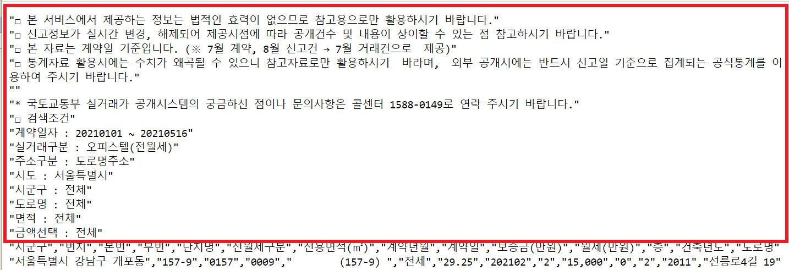
          
Description automatically added to file when downloading

        </section>        
        <section class="slide level2">    
          <ul>
          <li>
Needs removal before <code>pandas.read_csv()</code>
</li>
          <li>
Done manually ✔️ (or programmatically)
</li>
          </ul>
        </section>        
        <section class="slide level2">    
          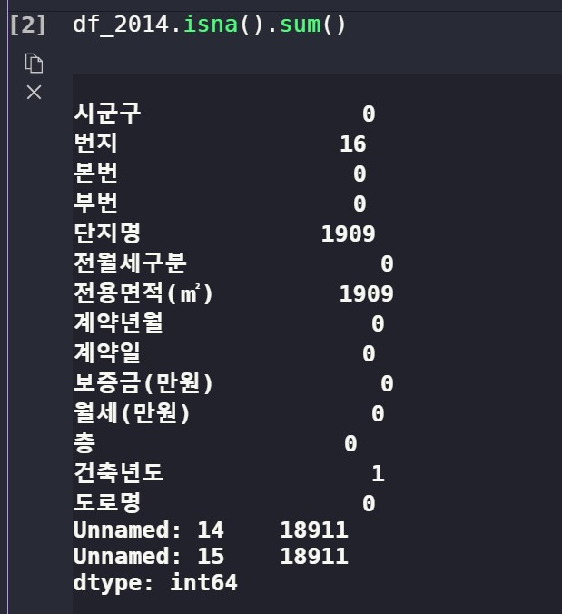  
          
                  
          <ul>
          <li>2014 file is “untidy”</li>
          <li>Needs cleanup
          </li>
          </ul>
          
  
        </section>        
        <section class="slide level2">    
          
Merge 10 datasets into one <code>pandas.DataFrame</code>

          

        </section>        
        <section class="slide level2">
          <h4>Fill in street addresses </h4>
          <ul>
          <li>Search and replace
</li>
          <li>
Done manually ✔️
</li>
          </ul>
        </section>
        <section class="slide level2">
          <h4>Fill in `year built` </h4>
          <ul>
          <li>with the district median</li>
          </ul>
        </section>
      </section>
      <!-- ============================================================== -->
      <!-- SLIDE: 2. EDA -->
      <section class="slide level1">
        <section id="eda" class="title-slide slide level2">
          <h2>2. EDA</h2>
          <ul>
            <li>Yearly Rental Volume</li>
            <li> Yearly Rental Volume by Type </li>
            <li>Stats by District</li>
            <li> Data Distribution by Key Feature </li>
            <li>Correlation Between Features</li>
          </ul>   	
        </section>
        <section class="slide level2">
          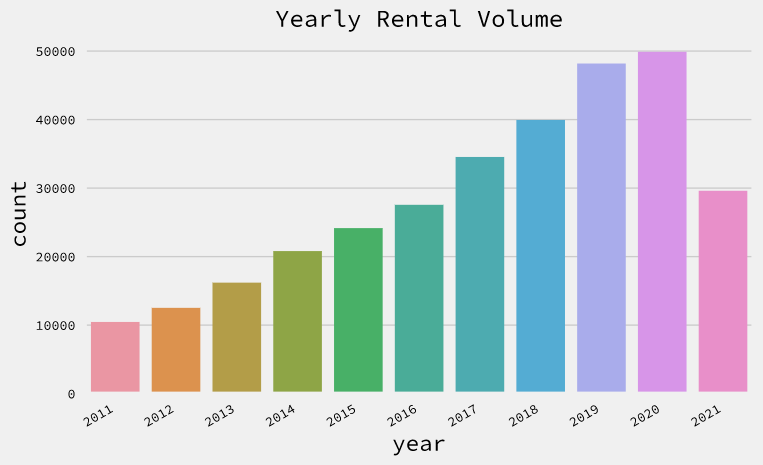
          
Rentals steadily increasing (2021 data as of July 31)
          
        </section>
        <section class="slide level2">
          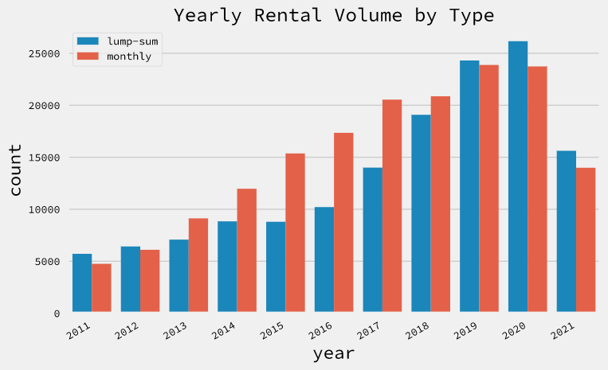
          
Covid-19 impact on the rental volume? None? 
          
        </section>
        <section class="slide level2">
          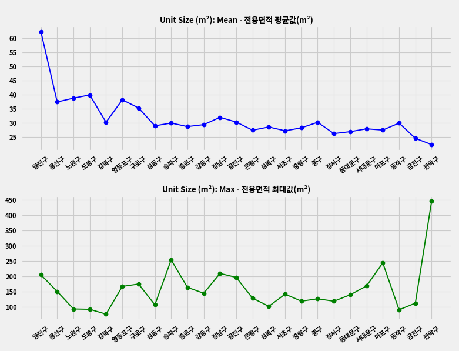
          
Unit Size (m²) by District
          
        </section>
        <section class="slide level2">
          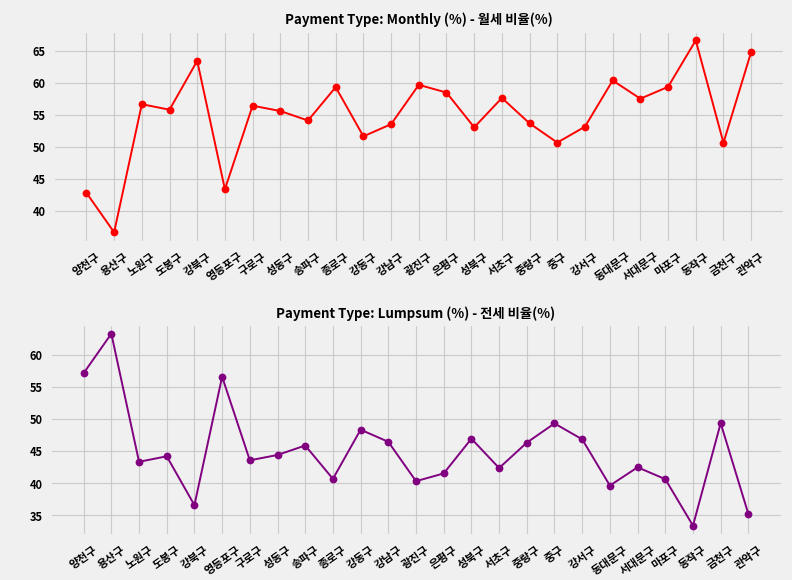
          
Rent Type Ratio by District
          
        </section>        
        <section class="slide level2">
          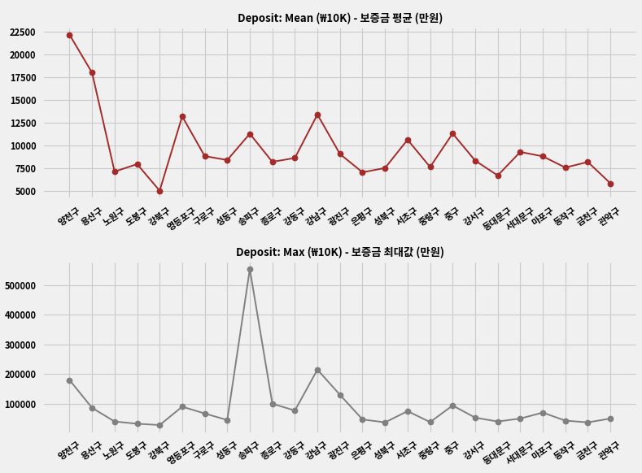
          
Deposit (in ₩10K) by District
    
        </section>        
        <section class="slide level2">
          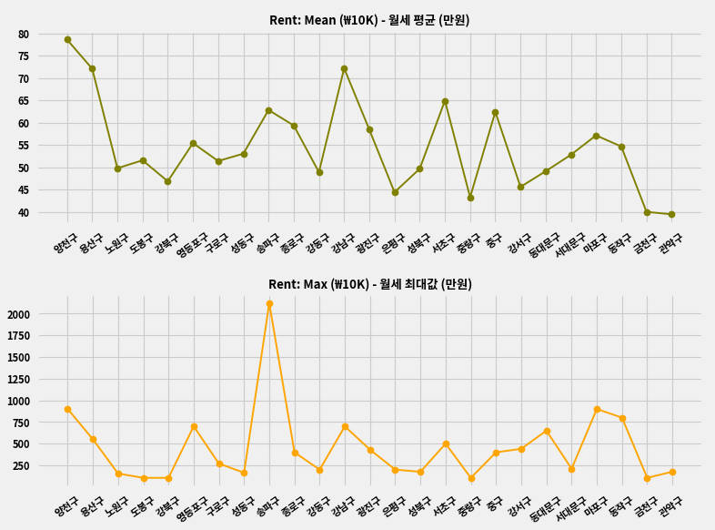
          
Monthly Rent (in ₩10K) by District
    
        </section>        
        <section class="slide level2">
          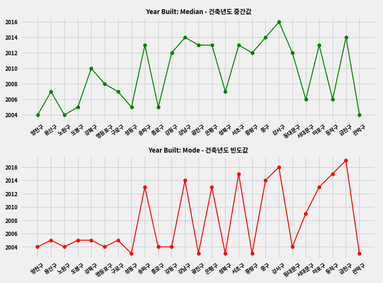
          
Year Built by District
    
        </section>        
        <section class="slide level2">
          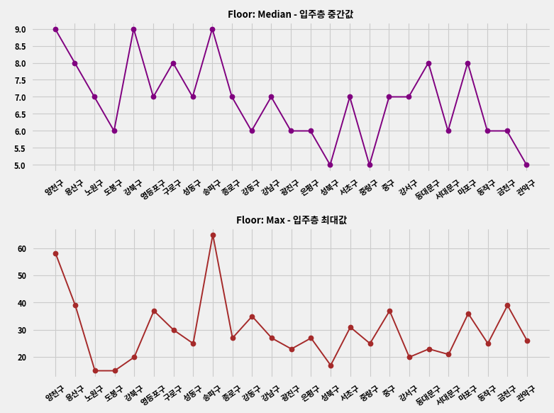
          
Unit Floor by District
    
        </section>        
        <section class="slide level2">
          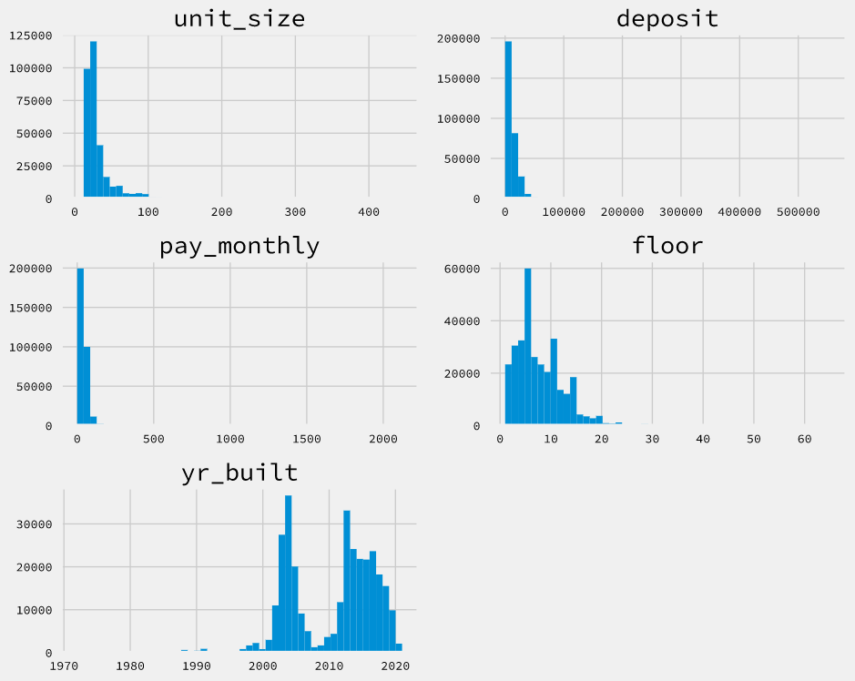
          
Data distribution → transformation necessary

        </section>        
        <section class="slide level2">
          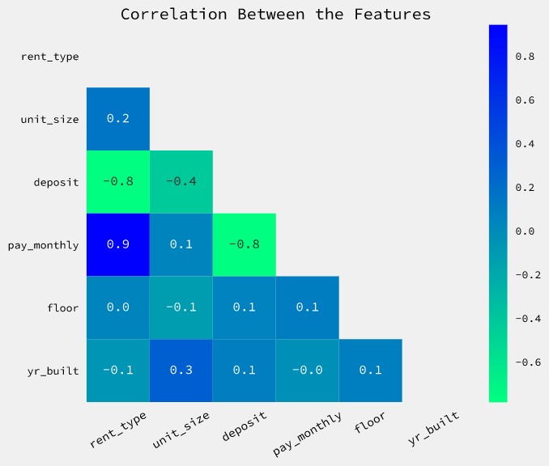
          
Feature Correlation

        </section>
      </section>
      <!-- ============================================================== -->
      <!-- SLIDE: Feature Engineering -->
      <section class="slide level1">
        <section id="feature-engineering" class="title-slide slide level2">
          <h2>3. Feature Engineering</h2>
          <ul>            
            <li> Add geometry to  <code>district</code> and  <code>street</code> </li>
            <li>Visualize data on a map</li>
            <li>Transform features</li>
            </ul>	
        </section>
        <section class="slide level2">
          <h4>Add Geometry </h4>
          <ul>
          <li>Shape files (.shp):
            <ul>
              <li><a href="http://data.nsdi.go.kr/dataset/15144">서울 행정구역시군구_경계</a> (국가공간정보포털)</li>
              <li><a href="http://http://data.nsdi.go.kr/dataset/12902">서울 도로명주소 도로구간</a> (국가공간정보포털)</li>
            </ul>
          </li>
          <li>
            Visualize with  <code>geopandas</code>  and  <code>geoplot</code>  
          </li>
          </ul>
        </section>        
        <section class="slide level2">
          
          
Rental Volumes in Five Groups

        </section>        
        <section class="slide level2">
          
          
Rental Units: Street Demarcation | 도로경계

        </section>
        <section class="slide level2">
          <h4>Data Transformation </h4>
          <ul>
          <li>unit_size</li>
          <li>deposit</li>
          <li>pay_monthly</li>
          <li>floor</li>
          <li>yr_built</li>
          </ul>
        </section>
        <section class="slide level2">
          <h4>Before Transformation </h4>
          
        </section>
        <section class="slide level2">
          <!-- <h4>Transformation  </h4> -->
          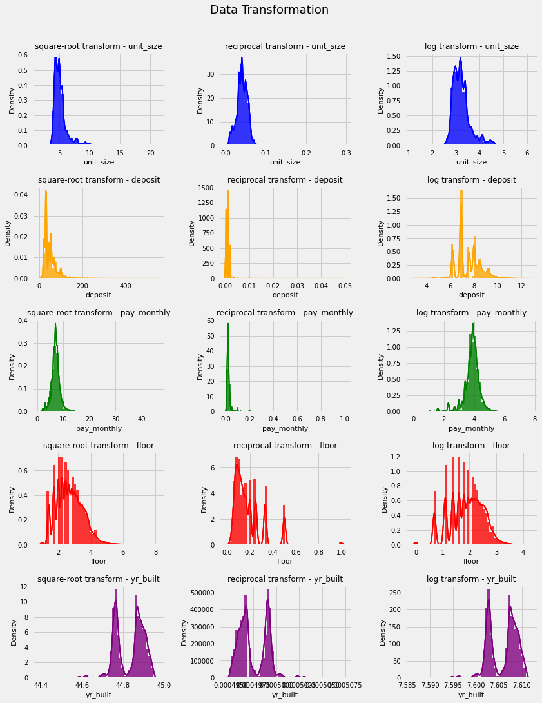
          
Methods: 1. Reciprocal 2. Square root 3. Logarithm

          <!-- 역수/multiplicative inverse, 제곱근,  -->
        </section>
        <section class="slide level2">
          <h4>Transformation Method </h4>
          <ul>
          <li> <code>unit_size</code>: Reciprocal </li>
          <li> <code>deposit</code>: Square root </li>
          <li> <code>pay_monthly</code>: Square root </li>
          <li> <code>floor</code>: Square root </li>
          <li> <code>yr_built</code>: Square root</li>
          </ul>
        </section>
      </section> <!-- END OF FEATURE ENGINEERING -->
      <!-- ============================================================== -->
      <!-- SLIDE: 4. Modeling -->
      <section class="slide level1">
        <section id="modeling" class="title-slide slide level2">
          <h2>4. Model Fitting</h2>
          <ul>            
            <li> Train Set: 284,284 rows, 2011 – 2020</li>
            <li>Test Set: 29,611 rows, Jan – Jul, 2021 </li>
            

            <li>Python libraries: <code>pysal</code>, <code>statsmodels</code> </li>
            <li>Baseline:  <code>rent</code>  ~ 
               <code>unit_size</code>  +  <code>deposit</code>   +  <code>floor</code>  +  <code>yr_built</code>  </li>
            <li>Baseline +  <code>district</code>  (fixed effects)</li>
            </ul>	
        </section>
        <section class="slide level2">
          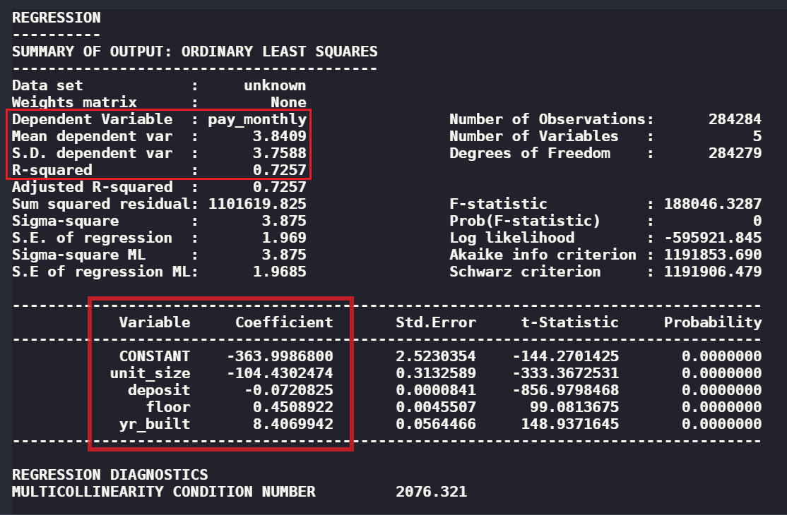
          
 Baseline model, R² score:  <code>0.73</code> 

        </section>
        <section class="slide level2">
          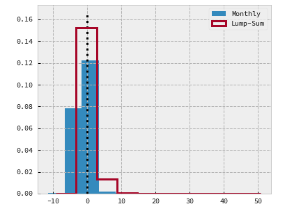
          
 Similar errors, but  greater variance for  <code>lump-sum</code>

        </section>
        <section class="slide level2">
          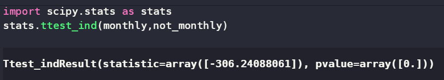
          
 <code>t-test</code> : two distributions are distinct.
          

        </section>
        <section class="slide level2">
          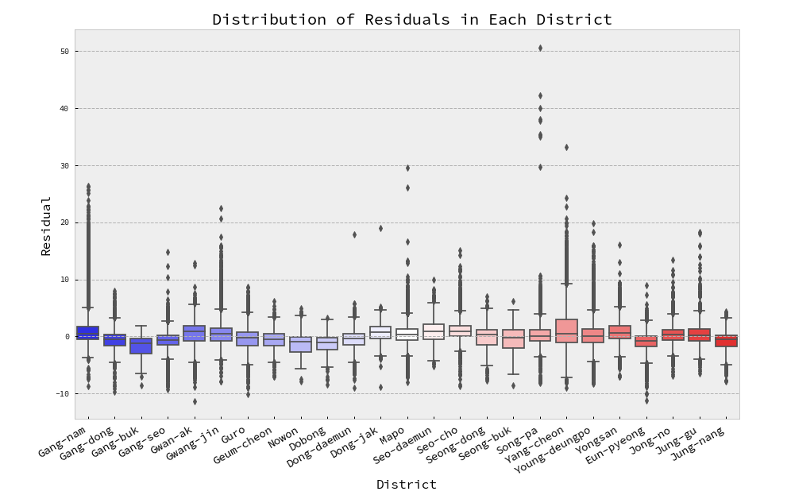
          
Some are higher: 강남구 , 용산구, 종로구, 중구, etc.
          

        </section>
        <section class="slide level2">
          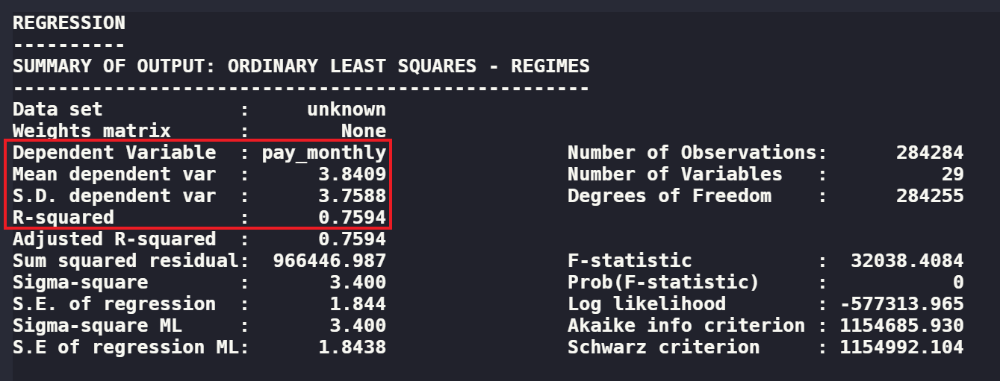
          
 Fixed effects model, R² score:  <code>0.76</code> 

        </section>
        <section class="slide level2">
          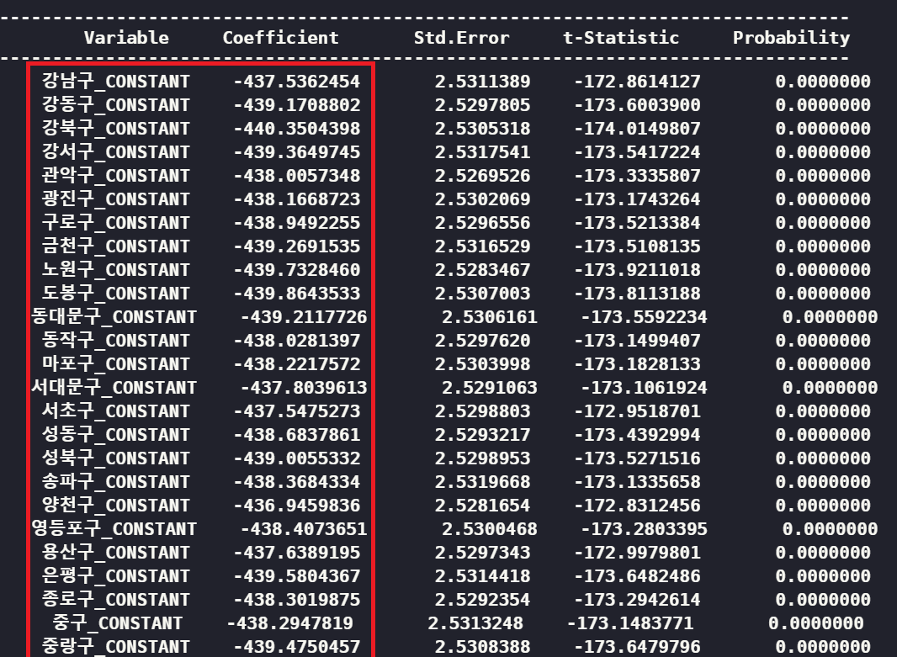
          
  <code>district</code>  as  fixed effects  

        </section>
        <section class="slide level2">
          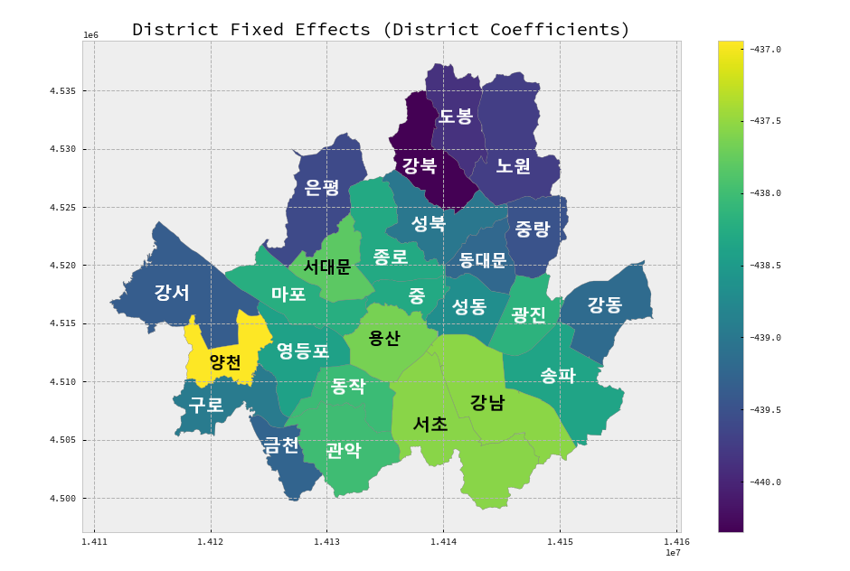
          
  <code>district</code>  fixed effects

        </section>
      </section> <!-- END OF Modeling -->
      <section class="slide level1">
        <section id="evaluation" class="title-slide slide level2">
          <h3>5. Prediction and Evaluation</h3>
          <ul>
            <li>Test Set: 29,611 rows (2021 data)</li>
            

            <li>Regressor: 
               Baseline + <code>district</code>  (fixed effects)
            </li>
          </ul>
        </section>        
        <section id="evaluation" class="title-slide slide level2">
          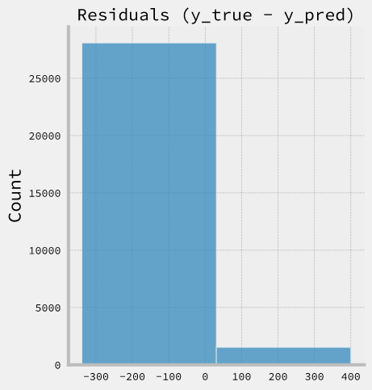
          
 Residuals negatively skewed 

        </section>        
        <section id="evaluation" class="title-slide slide level2">
          <h4>Evaluation Metrics</h4>
          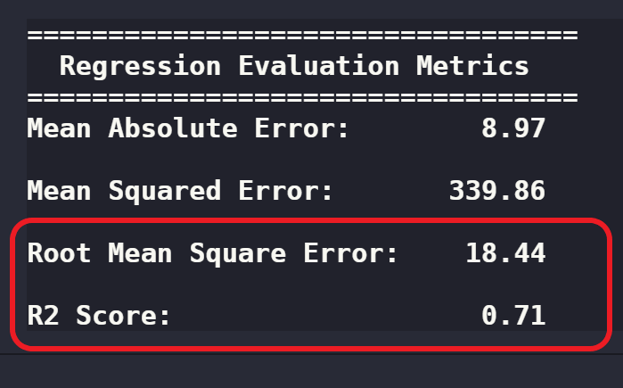
          
 Data size: approx. 10% of train-set 

        </section>
      </section>
      <!-- ============================================================== -->
      <!-- SLIDE: to be continued -->
      <section id="end" class="title-slide slide level1">
        <h1>The End</h1>
      </section>
      <!-- ============================================================== -->
      <!-- SLIDE: thank you -->
      <section id="thank-you" class="title-slide slide level1">
        <h1>Thank You</h1>
      </section>
    
 <!-- end of slides -->
  
 <!-- end of reveal div -->
</body>
</html>
